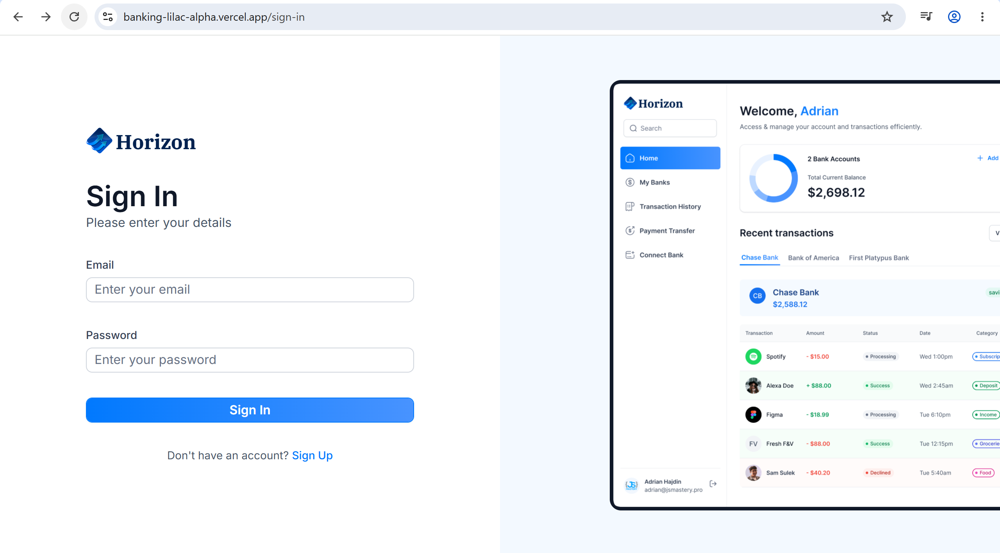
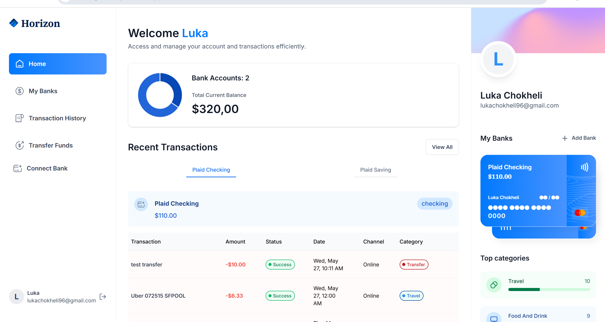
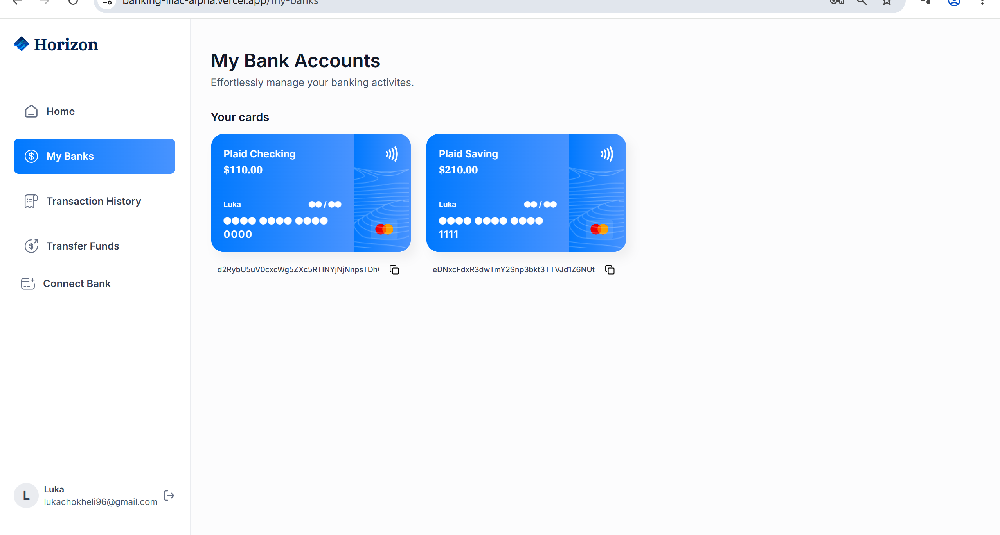
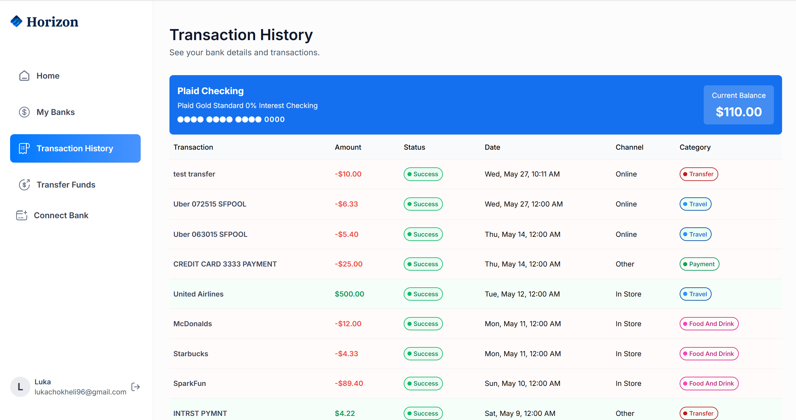
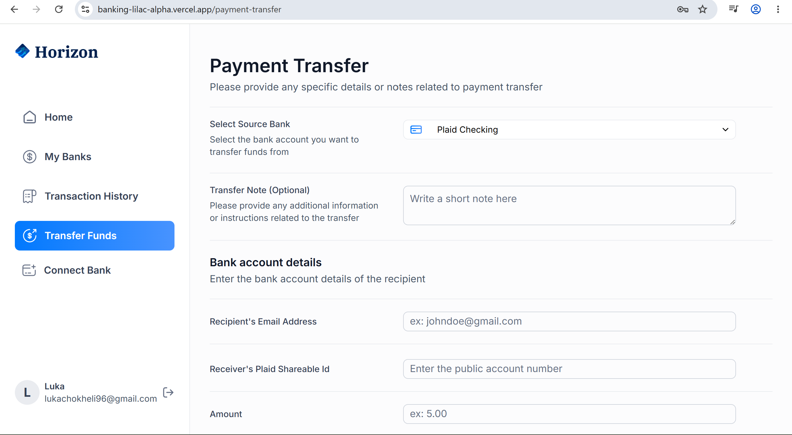
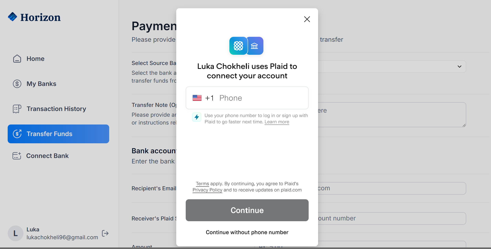

# Banking App

A modern banking web application built with Next.js, TypeScript, Tailwind CSS, Appwrite, Plaid, Dwolla, Sentry, and Vercel.

The application allows users to securely connect bank accounts, view balances, track transaction history, transfer funds, and manage financial activity through a responsive dashboard interface.

## Live Demo

[View Live Project](https://banking-lilac-alpha.vercel.app/)

Note: The application uses Plaid Sandbox for testing. See the Demo Access section below for test credentials.

## Demo Access

The application uses Plaid Sandbox for testing purposes.

After creating an account, connect a test bank account using the Plaid Sandbox credentials:

* Username: `user_good`
* Password: `pass_good`

You may also be prompted for test verification codes provided by Plaid Sandbox during the connection process.

Once connected, you can explore account balances, transaction history, and fund transfer functionality.

## Tech Stack

* Next.js
* React
* TypeScript
* Tailwind CSS
* shadcn/ui
* Appwrite
* Plaid
* Dwolla
* Sentry
* Chart.js
* Vercel

## Features

* Secure user authentication and onboarding
* Bank account connection with Plaid
* Account balance overview
* Financial data visualization with charts and analytics
* Transaction history
* Secure fund transfer functionality
* Responsive dashboard UI
* Error tracking with Sentry
* Backend service integration with Appwrite
* Deployed on Vercel

## Screenshots
Below are some screenshots showcasing the application's authentication flow, dashboard, account management, transaction history, and fund transfer functionality.

### Sign In

### Dashboard

### My Banks

### Transaction History

### Transfer Funds

### Add Bank Account

## What I Learned

While building this project, I gained experience with:

* Building a full Next.js application structure
* Working with TypeScript in a real project
* Creating reusable UI components
* Using Appwrite for backend services
* Integrating third-party APIs like Plaid and Dwolla
* Deploying a production project with Vercel
* Tracking errors with Sentry
* Building responsive layouts with Tailwind CSS

## Project Status

This project was built as a learning project to improve my skills with modern frontend development, backend-service integration, authentication, API handling, and deployment.

## Author

Luka Chokheli
GitHub: [@lukachokheli](https://github.com/lukachokheli)
